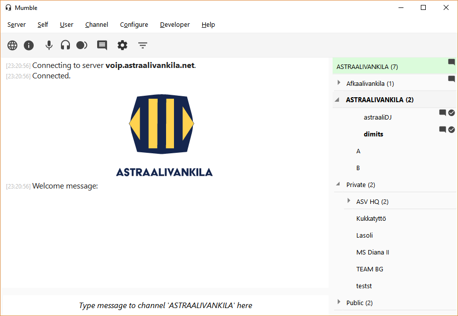

# M&MM - Modern & (Pseudo)Material Mumble
https://github.com/astraalivankila/TBA

*Based on mumble-theme - The new default theme for Mumble formerly known as MetroMumble.*

#### A simple Mumble theme with a few simple goals:

* Make Mumble look like a Modern software. It's 2017  ~~and Discord is taking over.~~
* Use Material [design guidelines](https://material.io/guidelines/).
* Keep it simple and neat.

All of these things are very much WIP.

*As an extra I try do document the QSS(SCSS) just to make things easier for everyone. I spent hours and hours trying to figure it out. Also, I would very much appreciate some help in finding the right selectors to improve it even more. See below:*

#### TO DO:
- [ ] Clean up the code
- [ ] Figure out a lot more selectors and QSS styling
- [ ] Settings view icons and styles
- [ ] Rework colors (it's all gray now)
- [ ] The only 'Material' things right now are the icons and (some) colors.
- [ ] Much more...

#### WHAT I WANT TO MODIFY BUT HAVE NO IDEA HOW
- 'Secure server' styling: currently servers with valid SSL certificates have a light green background. I want to change this to a simple lock icon.
- Make the server name stand out from the other list items (channels, users) (different font, more white space)
- Embed a custom font through QSS
- Use different font styling in user list view.
- Use a different font/style for channel names.
- Remove the ugly 1px black border from private messages. Use a subtle background and some padding to differentiate private messages from other messages.
- The user list icons should be ~4px lower. Figure out a way to target them.
- Adjust icon sizes EVERYWHERE. Seriously, they are too small.

##### THINK TWICE BEFORE TRYING TO MODIFY THIS THEME
** At least for now. The SCSS is still a mess.
You might end up breaking stuff.
Also, migraine. **

### Skinning

**Do not modify the qss files directly. Read below.**

To change icons and other graphics, simply change the SVG files of the theme (with an editor such as [Inkscape](https://inkscape.org/en/) or Adobe Illustrator).
See the [wiki article on Mumble skinning](http://wiki.mumble.info/wiki/Skinning).

The theme is written in [Sass](https://en.wikipedia.org/wiki/Sass_%28stylesheet_language%29), a language that processes into CSS (or [QSS](http://doc.qt.io/qt-4.8/stylesheet.html) in this case).
If you want to make your own skin based on it, install a Sass processor such as [Prepros](http://alphapixels.com/prepros/). A Prepros project file is included, so simply add the `mumble-theme` folder as a project.

The file `source/Imports/Base Theme.scss` contains the actual theme QSS, but it is **not recommended** to modify.
In future versions you might want to swap `Base Theme.scss` to a newer version, so it will be easier to update your theme in the future if you leave it alone.

Instead, you should edit either the `Lite.scss` file in the `source` folder, and add your own CSS at the end of the file.
You can also add your own variants in the `source/Imports` folder, which contain the color definitions.
When you process these files in Prepros, it will output the complete skin to the qss files in the parent folder.
The OSX variant can also be found in the `source` folder, which imports the regular source files but adds a small [OSX fix](https://github.com/xPoke/MetroMumble/issues/4) and modifies font sizes.
